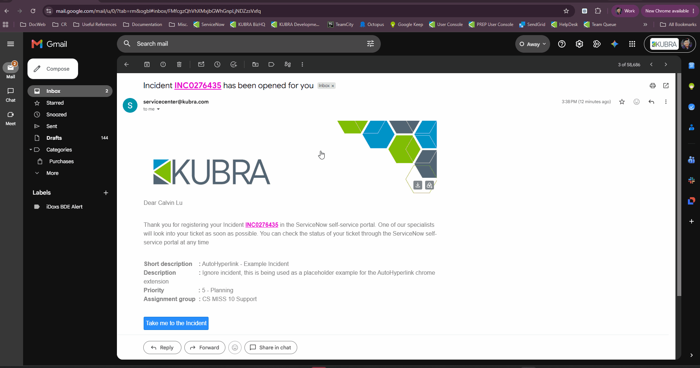
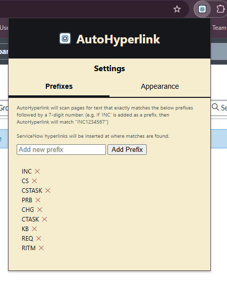
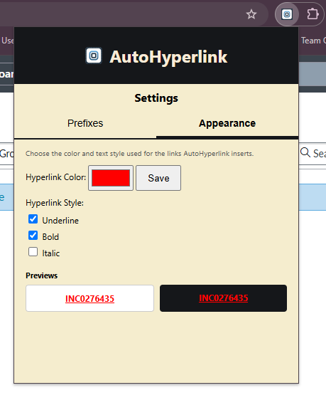
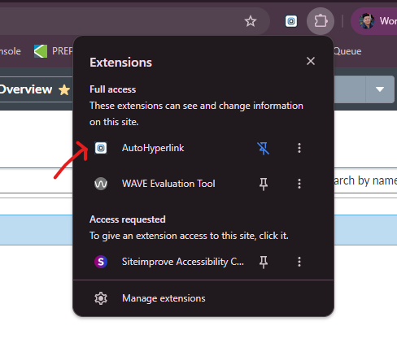

# AutoHyperlink

This is a Chrome extension that scans web pages for ServiceNow catalog identifiers (e.g. INC0276435), and then automatically turns them into clickable hyperlinks which link to the corresponding ServiceNow page. This eliminates the need to manually highlight then copy and paste ServiceNow catalog text into a search engine.



## Features

- **Inserts Hyperlinks on Detected Catalog Items**: The extension scans and detects any text on a web page that **exactly** matches a ServiceNow catalog ID, and then wraps it in a hyperlink.


- **Automatic Rescans on Navigation**: The extension rescans a tab whenever it detects page navigation or URL change.

- **Configurable ServiceNow Prefixes**: From the extension's popup settings, users can add or remove the ServiceNow catalog prefixes that the extension will detect. The default set of prefixes upon installation includes: (`INC`, `CS`, `CSTASK`, `PRB`, `CHG`, `CTASK`, `KB`, `REQ`, `RITM`).



- **Configurable Hyperlink Appearance**: Users can customize the inserted hyperlinks' color, and combine any of underline / bold / italic text styling. A live preview with the hyperlink against both a light and dark background is included



## How it works

- `source/Hyperlink.js` This is the content script that scans web pages for ServiceNow catalog IDs. This script builds a regex based on the user's configured ServiceNow prefixes, and then DFS traverses the page's DOM. During DOM traversal, any text that matches the regex is wrapped with a link that points to the ServiceNow page for that catalog ID. 
- `source/Background.js` This is the background script that listens for changes in the URL of the active tab. This captures events such as new page navigation, opening an email on Gmail, and etc.
- Settings (prefixes, hyperlink color, hyperlink text styling) are stored in `chrome.storage.local` and is read by both the popup and the content script. The default values of the aforementioned settings are sourced from `source/Defaults.js`
- The popup (`source/public/html/popup.html` + `popup.js`) provides two tabs, Prefixes and Appearance, switched via a small tab-bar click handler that toggles which panel is visible:
  - **Prefixes tab**: an input + "Add Prefix" button appends a new prefix (validated to 1-10 letters, rejecting duplicates), and each prefix in the list has its own remove (✕) button. Changes save to `chrome.storage.local` immediately.
  - **Appearance tab**: a native color picker paired with a  **Save** button (the colour only persists when Save is clicked, not while dragging the picker), plus Underline/Bold/Italic checkboxes that save as soon as they're toggled. A live preview re-renders instantly from whatever is currently selected in the UI.

## Installation

1. Download or clone this repository.
2. Open `chrome://extensions` in Chrome or `edge://extensions` in Edge.
3. Enable **Developer mode** (top-right toggle on Chrome, or bottom-left toggle on Edge).
4. Click **Load unpacked** and select this project's root folder (the root folder would be the folder that contains the `manifest.json` file).
5. Enable the extension and refresh your browser / open a new window for the extension to take effect. 

## Accessing extension settings

Click the puzzle icon on the top right of the browser (for both Chrome and Edge), and then click the AutoHyperlink extension. If the extension is pinned, then simply clicking the extension icon will open the menu.



## Project structure

```
manifest.json              
source/
  Hyperlink.js                 Content script: scans and links catalog IDs 
  Background.js                Background script: triggers re-scans on specific page events 
  Defaults.js                  Default settings
  public/
    html/popup.html            Popup UI
    css/popup.css              Popup styling
    js/popup.js                Popup logic for dynamic elements
```
